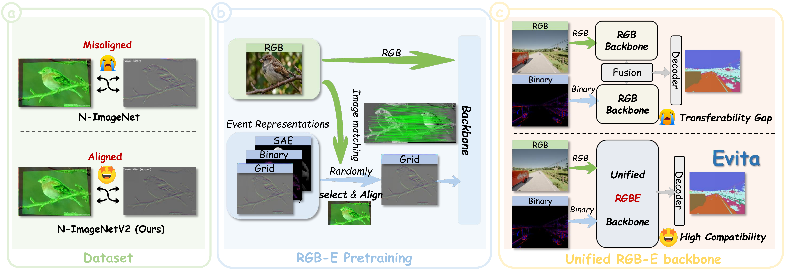
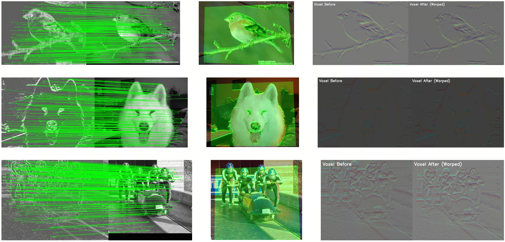
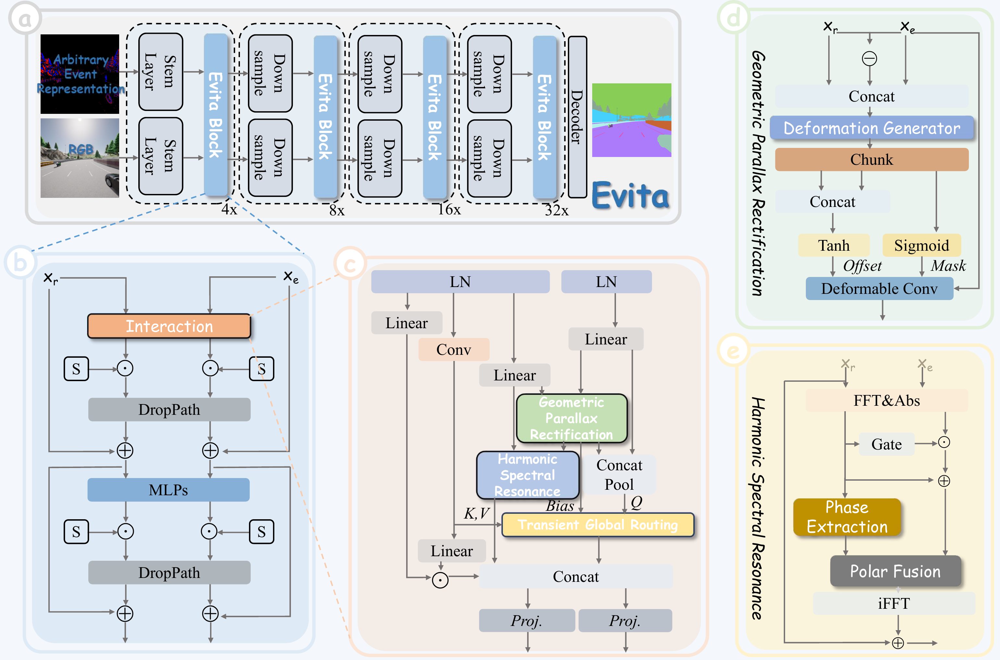
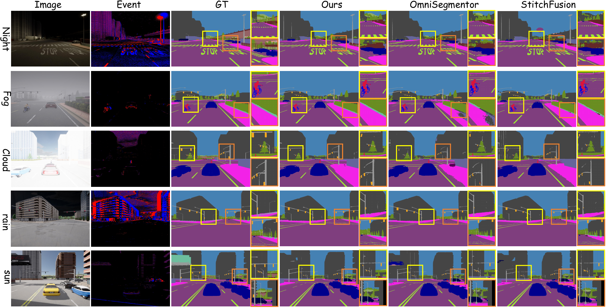

<div align="center">


<h1 align="center">Weaving Light and Time: Unified Harmonic-Geometric Representation Learning for Dense RGB-Event Parsing</h1>

<p align="center">
  Chenxu Peng<sup>2,1</sup> &nbsp;&nbsp;
  Chongtian Zhou<sup>2,1</sup> &nbsp;&nbsp;
  Dicheng Liu<sup>2,1</sup> &nbsp;&nbsp;
  Bowen Yin<sup>2</sup>
  <br>
  Yimian Dai<sup>1,2,3</sup> &nbsp;&nbsp;
  Xialei Liu<sup>1,2,3</sup> &nbsp;&nbsp;
  Ming-Ming Cheng<sup>1,2,3</sup> &nbsp;&nbsp;
  Xiang Li<sup>1,2,3,*</sup>
</p>
<p align="center">
  1 NKIARI, Shenzhen Futian &nbsp;&nbsp;
  2 VCIP, CS, Nankai University &nbsp;&nbsp;
  3 AAIS, Nankai University
  <br>
</p>

[](LICENSE)
[](#citation)
[](#)

</div> 

## Contents

- [Highlights](#highlights)
- [Overview](#overview)
- [News](#news)
- [Installation](#installation)
- [Pretrained Weights](#pretrained-weights)
- [DeLiVER Training and Evaluation](#deliver-training-and-evaluation)
- [DDD17 and DSEC Training and Evaluation](#ddd17-and-dsec-training-and-evaluation)
- [Visualization](#visualization)
- [Citation](#citation)

## TL;DR

We propose **Evita**, a unified RGB-E backbone specifically tailored for dense parsing. With our **N-ImageNetV2** and **custom pretraining**, Evita mitigates harmonic-geometric discrepancies and adapts to diverse event formats for an optimal accuracy-latency balance.

<p align="center">
  <a href="figs/fig1.pdf">
    
  </a>
</p>

## Highlights

- **N-ImageNetV2.** We address the large-scale misalignment between RGB and event images in N-ImageNet.
- **Unified architecture.** We build the first unified backbone specifically designed for RGB-E tasks.
- **Flexible training.** Evita supports a "multi-representation pretraining, single-representation fine-tuning" mechanism.
- **Efficient inference.** Evita discards redundant two-stream designs and enables lightweight, efficient, end-to-end inference.

## Overview

### N-ImageNetV2

<p align="center">
  
</p>

### Architecture

<p align="center">
  <a href="figs/fig3.pdf">
    
  </a>
</p>

## News

- [x] Release DeLiVER dataset weights.
- [x] Release DDD17 and DSEC dataset weights.
- [x] Release Evita pretrained weights.
- [ ] Release N-ImageNetV2 dataset.
- [ ] Release Evita pretraining code.

## Installation

```bash
pip install -r requirements.txt
```

## Repository Structure

```text
Evita/
├── code/
│   ├── DELIVER/       # DeLiVER training and evaluation code
│   └── DDD17_DSEC/    # DDD17 and DSEC training and evaluation code
├── figs/              # Figures used in the paper and README
├── requirements.txt
└── README.md
```

## Pretrained Weights

| Model | 3-channel weight | 10-channel weight |
| :---: | :--- | :--- |
| Evita-P | [Google Drive](https://drive.google.com/file/d/1CLlwCf-rq3weYx29EfACEEJMSzUv0O_N/view?usp=sharing) | [Google Drive](https://drive.google.com/file/d/1CLlwCf-rq3weYx29EfACEEJMSzUv0O_N/view?usp=sharing) |
| Evita-N | [Google Drive](https://drive.google.com/file/d/1CLlwCf-rq3weYx29EfACEEJMSzUv0O_N/view?usp=sharing) | [Google Drive](https://drive.google.com/file/d/1CLlwCf-rq3weYx29EfACEEJMSzUv0O_N/view?usp=sharing) |
| Evita-T | [Google Drive](https://drive.google.com/file/d/1CLlwCf-rq3weYx29EfACEEJMSzUv0O_N/view?usp=sharing) | [Google Drive](https://drive.google.com/file/d/1RtNfEPIHeQbe0noGWJy4V73jKd7ojg3z/view?usp=sharing) |
| Evita-S | [Google Drive](https://drive.google.com/file/d/1CLlwCf-rq3weYx29EfACEEJMSzUv0O_N/view?usp=sharing) | [Google Drive](https://drive.google.com/file/d/1RtNfEPIHeQbe0noGWJy4V73jKd7ojg3z/view?usp=sharing) |
| Evita-B | [Google Drive](https://drive.google.com/file/d/1CLlwCf-rq3weYx29EfACEEJMSzUv0O_N/view?usp=sharing) | [Google Drive](https://drive.google.com/file/d/1KHo5ONGl8D_CHV0opu372_jhRbsgIANe/view?usp=sharing) |
| Evita-L | [Google Drive](https://drive.google.com/file/d/1CLlwCf-rq3weYx29EfACEEJMSzUv0O_N/view?usp=sharing) | [Google Drive](https://drive.google.com/file/d/1f1XLOLCzoovb6IFFbexkLI86Tzb-tARg/view?usp=sharing) |

## DeLiVER Training and Evaluation

### Data Preparation

Please prepare the DeLiVER dataset following the official instructions:

```text
https://github.com/InSAI-Lab/DELIVER/tree/main
```

### Training

Before training, please download the pretrained Evita weights.

```bash
cd path/to/DELIVER
export PYTHONPATH="path/to/DELIVER"
python -m torch.distributed.launch --nproc_per_node=4 --use_env tools/train_mm.py --cfg configs/deliver_rgbdel.yaml
```

### Evaluation

```bash
cd path/to/DELIVER
export PYTHONPATH="path/to/DELIVER"
CUDA_VISIBLE_DEVICES=0 python tools/val_mm.py --cfg configs/deliver_rgbdel.yaml
```

### DeLiVER Model Zoo

| Model | mIoU | Weight |
| :---: | :---: | :--- |
| Evita-P | 48.21 | [Google Drive](https://drive.google.com/drive/folders/17Xj7j-5XY_ApduG2pldz_8kGjjK3eZn0?usp=sharing) |
| Evita-N | 52.91 | [Google Drive](https://drive.google.com/drive/folders/1KUHWlNMIy3LUgOUISSSUmhsH4D9MPZkD?usp=sharing) |
| Evita-T | 55.01 | [Google Drive](https://drive.google.com/drive/folders/1RlIjKdXoX2IYEiJ0ZuVecEFMlp2D5QLu?usp=sharing) |
| Evita-S | 56.79 | [Google Drive](https://drive.google.com/drive/folders/1RtRVEdy4HPdtBUQXxEVgQAe3nuoVkFPu?usp=sharing) |
| Evita-B | 58.02 | [Google Drive](https://drive.google.com/drive/folders/1J6Cl-b9SBhsWn2BPEFEcqNIEMvCSeJ9n?usp=sharing) |
| Evita-L | 59.57 | [Google Drive](https://drive.google.com/drive/folders/1e0skwjFnYrDs7z9SpcAz7NUhUS-SPr9-?usp=sharing) |

## DDD17 and DSEC Training and Evaluation

### Data Preparation

Please prepare DDD17 and DSEC following:

```text
https://github.com/CQU-UISC/MambaSeg
```

### Training

Before training, please download the pretrained Evita weights.

```bash
python train_ddd17.py
python train_dsec.py
```

### Evaluation

```bash
python evaluate.py
```

### DDD17 Model Zoo

| Model | mIoU | Weight |
| :---: | :---: | :--- |
| Evita-P | 71.26 | [Google Drive](https://drive.google.com/file/d/1v1Tmfs3FIJJ_wcMrQgscfsNdmVodenT1/view?usp=sharing) |
| Evita-N | 74.84 | [Google Drive](https://drive.google.com/file/d/15WPEcqPPRZcRoNsmUdcNNPXU-9ikYPPr/view?usp=sharing) |
| Evita-T | 77.04 | [Google Drive](https://drive.google.com/file/d/1eB6LI0ub4DXXsKW-RQW-wVicX5Tqsv4S/view?usp=sharing) |
| Evita-S | 78.56 | [Google Drive](https://drive.google.com/file/d/1aUoSG3Adf-aSkX7Fs8ZsQxH-ESLnFiik/view?usp=sharing) |
| Evita-B | 79.11 | [Google Drive](https://drive.google.com/file/d/1VESZsKrwF8MiNy_RwQz37Csk5EzojNML/view?usp=sharing) |
| Evita-L | 80.12 | [Google Drive](https://drive.google.com/file/d/148TcjM-vVO5dEwo1P7H6v_gUJnPantdb/view?usp=sharing) |

### DSEC Model Zoo

| Model | mIoU | Weight |
| :---: | :---: | :--- |
| Evita-P | 65.55 | [Google Drive](https://drive.google.com/file/d/1A1frGGsxlao7TuIxo8JdSnQGsNAoTF7t/view?usp=sharing) |
| Evita-N | 70.09 | [Google Drive](https://drive.google.com/file/d/1OS0k_V1KPG_zKJ5ZfqQFSnnSDWTSWWuA/view?usp=sharing) |
| Evita-T | 73.90 | [Google Drive](https://drive.google.com/file/d/1rPER_XLeezDmnppd3CZkBgpucjdvcNSN/view?usp=sharing) |
| Evita-S | 75.07 | [Google Drive](https://drive.google.com/file/d/1De9Cp1W71kHHF3GWpq42KdP5_AUkZZOb/view?usp=sharing) |
| Evita-B | 76.08 | [Google Drive](https://drive.google.com/file/d/1mpGfPJbZ_ip_EvrjZ9e9U2BKXabUzeKd/view?usp=sharing) |
| Evita-L | 76.80 | [Google Drive](https://drive.google.com/file/d/1RLVMqthXb4BSoXERErMZLNAfsIzW0GNE/view?usp=sharing) |

## Visualization

<p align="center">
  <a href="figs/fig4.pdf">
    
  </a>
</p>

## Acknowledgements

This repository builds upon the following excellent public repositories:

- [DELIVER](https://github.com/InSAI-Lab/DELIVER/tree/main)
- [MambaSeg](https://github.com/CQU-UISC/MambaSeg)

## License

This repository is released under the Apache-2.0 license. For commercial use, please contact the authors.

## Citation

If you use the N-ImageNetV2 dataset or the Evita model, please cite the following work:

```bibtex
@inproceedings{peng2026weaving,
  title={Weaving Light and Time: Unified Harmonic-Geometric Representation Learning for Dense RGB-Event Parsing},
  author={Chenxu Peng, Chongtian Zhou, Dicheng Liu, Bo-Wen Yin, Yimian Dai, Xialei Liu, Ming-Ming Cheng, Xiang Li},
  booktitle={Arxiv},
  year={2026}
}
```
